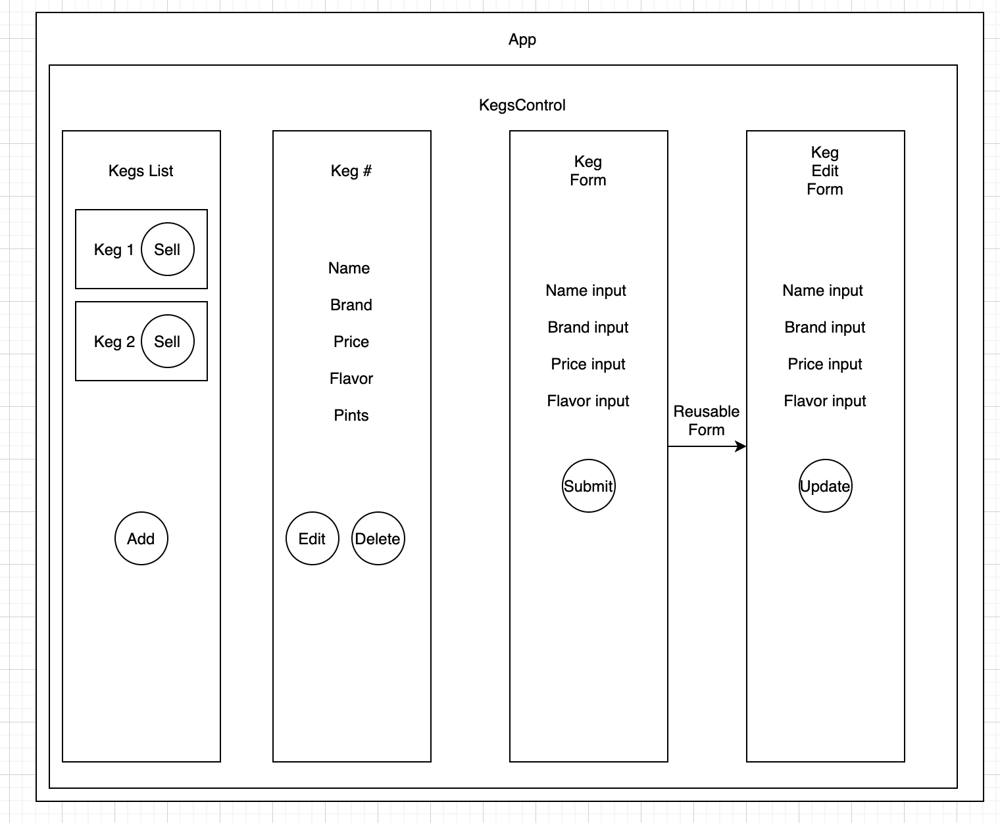

# Komucha Tap Room

#### A website where a kombucha store can track their kegs

#### By Araceli Valdovinos

## Technologies/Tools Used

* _JavaScript_
* _HTML_
* _CSS/Bootstrap_
* _npm,webpack_

## Description
_A tap room application built in React where a kombucha store can track their kegs and their remaining amount. The application meets the following user stories:_

* _As a user, I want to see a list/menu of all available kegs. For each keg, I want to see its name, brand, price and alcoholContent (or perhaps something like flavor for a kombucha store)._
* _As a user, I want to submit a form to add a new keg to a list._
* _As a user, I want to be able to click on a keg to see its detail page_
* _As a user, I want to see how many pints are left in a keg. Hint: A full keg has roughly 124 pints._
* _As a user, I want to be able to click a button next to a keg whenever I sell a pint of it. This should decrease the number of pints left by 1. Pints should not be able to go below 0._

## Component Diagram

## Setup/Installation Requirements

_Clone repo:_
* _Clone the repository to desktop using `git clone` in terminal_
* _Open clone folder in text editor of your choice_

_Execute tests:_
* _Run `npm test` in terminal/command line_

_View in browser:_
* _Run `npm start` start in terminal/command line_

## Known Bugs

* _Any known issues_
* _should go here_

## License

## Contact Information
_Araceli Valdovinos valdovinosaraceli50@gmail.com_
